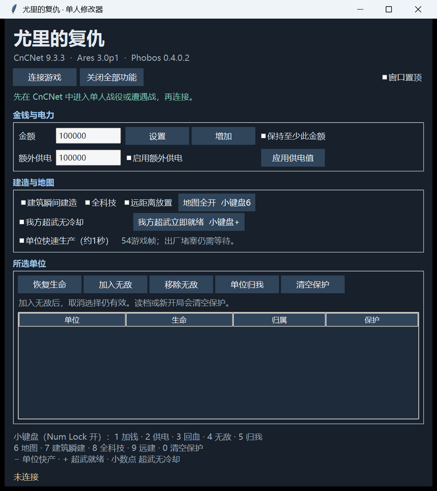

# RedAlert2Trainer

红色警戒2《尤里的复仇》单人修改器，适配已验证的 CnCNet / Ares / Phobos 版本。

单文件 EXE 见 [Releases](https://github.com/zhaoshuoxp/RedAlert2Trainer/releases)。进入单人地图后连接游戏；仅需复制一个 EXE 即可运行。

## 参考来源

- [AdjWang/RA2YurisRevengeTrainer](https://github.com/AdjWang/RA2YurisRevengeTrainer)：参考修改器实现思路。
- [Phobos-developers/YRpp](https://github.com/Phobos-developers/YRpp)：参考游戏类结构、字段及函数地址。
- [CnCNet/yrpp-spawner](https://github.com/CnCNet/yrpp-spawner)：参考 CnCNet 单人运行环境。
- [Keystone Engine](https://github.com/keystone-engine/keystone)：生成运行时 x86 桥接指令。

## 大致实现方法

Python / Tkinter 提供中文界面，Win32 API 读取游戏进程并安装可恢复的内存补丁。连接前校验实际加载模块的 SHA-256 和单人游戏状态；引擎调用放在游戏主循环内执行。游戏文件不做修改。

资源、生产与超武功能均检查当前玩家归属；单位保护使用对象地址和唯一标识共同匹配。建筑保留最后一步的原生扣款和就绪处理，单位则逐步缩短等待，保留出厂流程。超武直接清零剩余计时并交由游戏处理就绪状态，避免百分比计算留下最后1帧。

正常退出会恢复本程序安装的指令；读档或新开局清空保护及功能开关。已揭开的地图、已接管单位和资源消耗不会自动撤销。

## 功能说明

打开 Num Lock；热键仅在游戏前台响应，不切换窗口。

| 小键盘 | 功能 |
|---|---|
| 1 | 增加金钱；界面也可设置或保持最低金额 |
| 2 | 开关我方额外供电 |
| 3 | 所选单位回血 |
| 4 | 所选单位加入普通伤害保护，取消选择仍有效 |
| 5 | 所选单位归我 |
| 6 | 地图全开 |
| 7 | 开关我方建筑瞬间建造 |
| - | 开关我方单位快速生产，完整项目约54游戏帧 |
| 8 | 全科技，仍需相应工厂 |
| 9 | 远距离放置，仍受地形限制 |
| 0 | 清空单位保护 |
| + | 我方超武立即就绪 |
| . | 开关我方超武无冷却 |

金钱、电力、建筑/单位生产及超武充能不作用于电脑或盟友。单位约54游戏帧完成生产，60帧/秒时约0.9秒，出口堵塞仍需等待；超武不会绕过暂停/断电或干扰正在耗能的武器。单位保护不覆盖所有脚本删除、超时空抹除等特殊机制。

版本指纹见 `fingerprints.json`；不匹配时拒绝连接。最新生产及超武修复通过原游戏指令仿真，完整放置、出厂和超武实际发射仍待实机回归。

## 界面截图

